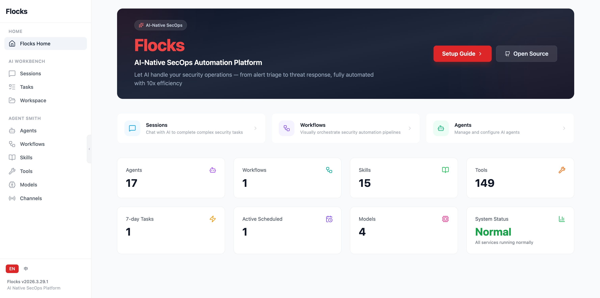

# Flocks

[English](README.md) | **简体中文**

AI 原生 SecOps 平台



## 项目概览

Flocks 是一个以 Python 构建的 AI 驱动型 SecOps 平台，具备多智能体协作、HTTP API 服务与现代化终端用户界面，用于辅助完成各类 SecOps 任务。

## 功能特性

- 🤖 **AI 智能体系统** — 多智能体协作（构建、规划、通用）
- 🔧 **丰富工具集** — bash、文件操作、代码搜索、LSP 集成等
- 🌐 **HTTP API 服务** — 基于 FastAPI 的高性能 API
- 💬 **会话管理** — 会话与上下文管理
- 🎯 **多模型支持** — 支持 Anthropic、OpenAI、Google 等 AI 模型
- 📝 **LSP 集成** — 语言服务器协议支持
- 🔌 **MCP 支持** — Model Context Protocol
- 🎨 **TUI 界面** — 现代化终端用户界面
- 🖼️ **WebUI** — 基于浏览器的 Web 用户界面

# 安装与使用

Flocks 支持两种部署方式：

- `方案 1：终端安装` （推荐）
- `方案 2：Docker 安装`

请选择以下任一方式。

## 方案 1：终端安装

### 系统要求

- `uv`
- `Node.js` 与 `npm` `22.+`
- `agent-browser`
- `bun`（可选，用于 TUI 安装）

默认情况下，项目安装脚本会在可行时尽量自动满足上述要求。

如果安装过程中自动安装 `npm` 失败，请手动安装 `npm`，并使用 `22.+` 或更高版本。

### 快速安装

> **中国大陆用户**：默认推荐使用 Gitee 上的 `install_zh` 一键安装脚本；如果你希望先审查仓库内容，也可以先从 Gitee 克隆源码后再安装，见下文「源码安装」。

#### macOS / Linux

```bash
curl -fsSL https://gitee.com/flocks/flocks/raw/main/install_zh.sh | bash
```
默认会在当前目录下创建 ./flocks

#### Windows PowerShell (Administrator)

```powershell
powershell -c "irm https://gitee.com/flocks/flocks/raw/main/install_zh.ps1 | iex"
```

### github源码安装

克隆到本地后在工作区执行安装脚本：

```bash
git clone https://gitee.com/flocks/flocks.git flocks
cd flocks
```

Macos/Linux
```bash
./scripts/install_zh.sh # Macos/Linux
```

Windows powershell (Administrator)
```bash
powershell -ep Bypass -File .\scripts\install_zh.ps1 # Windows powershell
```

### 启动服务

使用 `flocks` CLI 以守护进程方式同时管理后端与 WebUI。
`flocks start` 默认会先构建 WebUI 再启动；如果需要显式全量重启，请使用 `flocks restart`。

#### macOS / Linux / Windows PowerShell

```bash
flocks start
flocks status
flocks logs
flocks restart
flocks stop
```

默认服务地址：
- 后端 API：默认 `http://127.0.0.1:8000`
- WebUI：默认 `http://127.0.0.1:5173`
- 远程访问修改 `flocks start --server-host <ip> --webui-host <ip>`

更多 CLI 命令使用 `flocks --help`

## 方案 2：Docker 安装

> [!NOTE]
> docker 版本暂时 agent-browser headed 模式不可用

### 拉取镜像

```bash
docker pull ghcr.io/agentflocks/flocks:latest
```

## 启动服务

运行容器，并将宿主机用户的 `~/.flocks` 目录挂载到容器内：


macOS / Linux
```bash
docker run -d \
  --name flocks \
  -e TZ=Asia/Shanghai \
  -p 8000:8000 \
  -p 5173:5173 \
  --shm-size 2gb \
  -v "${HOME}/.flocks:/home/flocks/.flocks" \
  ghcr.io/agentflocks/flocks:latest
```

Windows PowerShell
```powershell
docker run -d `
  --name flocks `
  -e TZ=Asia/Shanghai `
  -p 8000:8000 `
  -p 5173:5173 `
  --shm-size 2gb `
  -v "${env:USERPROFILE}\.flocks:/home/flocks/.flocks" `
  ghcr.io/agentflocks/flocks:latest
```

默认服务地址：
- 后端 API：默认 `http://127.0.0.1:8000`
- WebUI：默认 `http://127.0.0.1:5173`

## 常见问题

### 中国用户：加速 Python 包安装

在中国大陆的机器上，可以将 `uv` 配置为使用本地 PyPI 镜像，以加快包下载。

创建 `~/.config/uv/uv.toml`，内容如下：

```toml
[[index]]
url = "https://pypi.tuna.tsinghua.edu.cn/simple"

[[index]]
url = "https://pypi.org/simple"
default = true
```

### Docker 问题

Docker 国内镜像地址
``` bash
ghcr.nju.edu.cn/agentflocks/flocks:latest
```

启动后 `/home/flocks/.flocks` 权限问题

``` bash
-v "$HOME/.flocks:/home/flocks/.flocks:Z" \
```
或
```bash
docker run --rm --entrypoint id ghcr.io/agentflocks/flocks
# example result: uid=1001(flocks) gid=1001(flocks) 组=1001(flocks)
sudo chown -R <uid>:<gid> ~/.flocks
# example: sudo chown -R 1001:1001 ~/.flocks
```

### 远程访问 Flocks 服务
```bash
__VITE_ADDITIONAL_SERVER_ALLOWED_HOSTS=<your_domain> \
flocks start --server-host 127.0.0.1 --webui-host 0.0.0.0
```
虚拟机远程访问失败请指定 host 为虚拟机 IP。

## 加入社区

请使用**微信**扫描下方二维码，加入官方交流群。  


## 开源协议

Apache License 2.0
